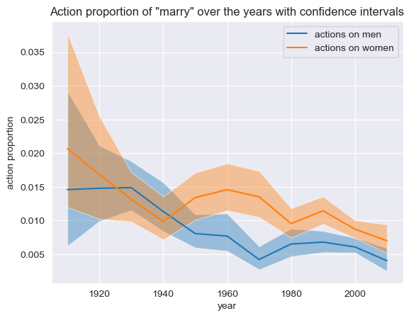
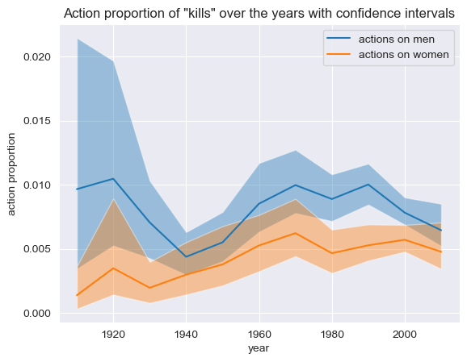

"If [Marilyn Monroe] still fascinates us so much, it is because her story echoes the diktat that continues to mark out women's lives in a world controlled by the male gaze."

It is by this powerful observation that the documentary "Becoming Marilyn", released in 2021 by Arte Cinema, is introduced. This tells us two things: that women characters have failed to be more than projections of men's expectations, and that the cinema in itself can be consider as a representation of our society and its diktats.

With this project, we would like to tackle the subject of gender representation in movies across time. Strong believers that women are more than gentle creatures and men are not only super strong, we want to investigate if the movies industry followed and still follows these stereotypes, and how does it varies between countries and movies genres.

### A. what is the gender parity across movie genres (are westerns still as male dominated as the stereotype describes it?)

### B. what is the evolution of gender parity in films among countries over time (were some countries avant-garde? Are some still behind on this concept?)

As a next analysis, we wanted to determine how the gender parity is distributed among different countries, and how this rate changed over time. First, we saw how it is currently distributed all over the world, and plotted it on a heatmap.

As we can see, the USA 

### C. Is there a variation in the box office revenue depending on the gender parity? Has it changed over the years?

### D. Is there a variation of the main attributes -agent verbs, patient verbs and attributes- given to each gender across time?

What we mainly searched for in this section, is the type of action each gender is performing, and in perticular if a certain gender acts more than the other, or if it is more acted upon. To do so, we calculated the ratio of the actions done _by_ the subject over the actions done _on_ the subject. 

On one hand, the female characters act more than they are acted on, as their ratio has been constantly lower than 0.5 since the 1920's, but on the other hand, relatively speaking, once again, women tend to be more often the objects of actions than men, as this ratio is constantly greater for women than for men. 

We then studied the total number of actions done by men and by women, and plotted this ratio. 

This ratio is constanly well over 1, which is not too surprising, as the gender ratio showed us that overall there are far more male characters than female ones, so it is expected to see them do more actions than women. 

Finally, we wanted to study a bit the most frequently used actions. In perticular, we studied the actions "Marry", "Love" and "Kill", which seemed pretty interessant for us, to see if they are more performed *on men* or *on women* over the years. 

We wanted to know if these actions ended up being used more often on male/female over the years or not. In this plots, the "word importance" is defined as the number of times each action occurs in average in each plot. What we see is that this importance doesn't really change for "Love" or for "Kill". For "Marry", it decreases for both genres. Even though it doesn't tell us much for the difference over genders, it could go to show us the loss of importance of marriage in our society, as this tradionnal structure loses its power as the years go (but that definitely is a stretch, and would require a whole different analysis for us. We just thought it was funny to see the fact that the action "Marry" became less prominent over the year even though the action "Love" didn't change much).

### E. Do the mean age of the actors, male and female, evolves over the years? (with the cliché in mind that +40-year-old actresses are "outdated")

We wanted to see what the mean age for actors is over the years, for males and females. When plotting this directly, we got those results : 

Clearly, the average male actor is older than the average female actor. Overall, the gap between the age of male actors and the age of female actors stayed the same over the years, with the female actors being constantly between 5 and 10 years younger than their male counterpart on average. This seems to go in the direction of the stereotype of older women not having their place as old actresses. The mean age of male actors crossed the 40 year old bar after the 2000, whereas the mean age of actresses is barely above 35 year old, and only ponctually in time. A second thing we can see with this graph is how the average age goes up over the years, for both male and female actors. This could be seen as a generally good thing, as it depicts a larger picture of our society, and not just young people. 

We then asked ourselves if this trend of the mean ages going up was a real trend, or if it wasn't just because life expectancy went up during the studied period of time. Thus, we plotted the mean "life percentage" of actors by genre, aka the ratio age over life expectency for each genre. 

[image](assets/mean_life_percentage_actors.png)

This changed things a bit : now, before 2000, the relative age of actors was going down instead of up, be it for men or for women. But after 2000, it started going up again, for both genres, going once again in the same direction as before. Nonetheless, the conclusion is still the same : the actress are constantly way younger than men, be it before 2000 or after. This once again goes in the stereotype that women should be young and beautiful to succeed on the big screen, and that the older they get, the more outdated they are. 

### F. Can we built the perfect archetypes of the male and female actor (age, height, ethnicity) over time?
