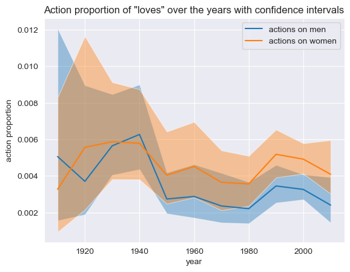

With Christmas coming up very soon, you must have seen them everywhere, or they were given to you when you were a child: the oh-so-stereotyped Christmas gifts. When little girls receive baby dolls, makeup kits and fashion sketchbooks, little boys are blessed with dinosaurs, fire engines, and false hardware tools. The new generations of parents are more and more aware that these stereotyped gifts are founded on nonsense assumptions, such as “a girl’s dream is to be the prettiest” and “every boy wishes to join the army”. Moreover, it has been shown that this entire sexist mindset has led, among other consequences, to professional categories showing a very small number of women enrolled. Just look at EPFL, or any other engineering school …

With this project, we decided to work on another part of our culture which appears in our mind as a good representative of gender stereotypes: movies. In fact, while doing some research on the movie industry in order to decide with which angle we would like to approach our dataset, we came across this sentence: 

**“If [Marilyn Monroe] still fascinates us so much, it is because her story echoes the diktat that continues to mark out women's lives in a world controlled by the male gaze.”**

This powerful observation signes the introduction of the documentary “Becoming Marilyn”, released in 2021 by Arte Cinema. And it taught us two things: that women characters have failed to be more than projections of men’s expectations, and that the cinema in itself can be consider as a representation of our society and its diktats.

With this project, we would like to tackle the subject of gender representation in movies across time. Strong believers that women are more than gentle creatures and men are not only super strong, we want to investigate if the movies industry has displayed a satisfying gender representation, and how does it varies between countries and movies genres.

### **What is the gender parity across movie genres?**

We decided to start our investigation with an increasingly used metric these days: gender parity.  Calculated as the ratio of women among the actors displayed in each movie, we wanted to see if this metric is impacted by the movie genre. 

Displayed below, the gender parity by movie genres with 95% confidence interval calculated for each genre that appears more than a 100 times in our dataset, and the evolution of this ratio before and after 2000. Only red arrows show evolution statistically significant under α = 0.05. 

The first main result of this study is that sadly, **there is no movie genre that has a gender parity over 50%**, even within the 95% confidence interval. Secondly, among the ten highest ranked genres, five of them are a type of *comedy*, and three of them contain the world *romance* or *romantic*. **Women are therefore more displayed in movies created for a mainstream audience, and are more represented in movies that include a romantic plot** (which does not seem too surprising, since most of the relationships displayed in movies are heterosexual). On the other hand, the five lowest ranked genres include *War*, *Gangster*, *Western*, which are known to display a high level of violence and the use of weapons. 

We can also conclude that **movie genre is significantly impacting gender ratio**, since the average ratio is out of confident intervals for many movies genres.

To bring some good news, the evolution of gender parity across movie genres shown that **for most of them, this evolution is positive**. The winner of this race is by far the *Japanese movies* genre, with an increase of approximatively 15%. Its evolution is displayed below, and one can see the good overall improvement, even if it’s not a linear one. Among the ten highest ranked genres, two of them (*Romantic Comedy* and *Romantic Drama*) show a statically significant improvement, and among the ten lowest ranked, two of them also show a positive evolution (*Action* and *Action/Adventure*). Therefore, the conclusion of this evolution is that the best ones often do better over time, and the others also try to do better in general, which is full of hope for the future!
### **What is the evolution of gender parity in films among countries over time?**

After considering movie genres, the next thing we wanted to tackle was the evolution of this gender parity among countries. Again, we looked at this value with 95% interval, here among the countries that had more than 20 occurrences. We also considered the evolution of this ratio before and after 2000. Only red arrows show evolution statistically significant under α = 0.05. 

Little glimpse of patriotism here for the French members of the team: France comes out first, followed by Canada. Are countries containing French speakers less sexists than the rest? The answer could be yes considering the gender ratio in their movies. 

Let’s give a look at the rest of the facts. Sadly here, once again, **the gender parity does not reach the 50%**, even within the 95% confidence interval. Beside, we cannot observe a significant impact of country on the gender ratio. Indeed, average ratio is inside of confident intervals for many countries. We can also say that this ratio does not seems to depend on the continent in which the countries is located. For instance, France and Czech Republic are respectively ranked 1st and 23rd, and South Korea and Hong Kong are 6th and 18th. To support this idea, we decided to plot these data on a heatmap, displayed below. 

Among the 24 countries displayed in these graphs, **only three of them show a significantly positive evolution between before and after 2000**: USA, Japan (which is coherent with the evolution of the “Japanese movies” genre studied above) and South Korea.

Therefore, we are a bit disappointed by the conclusions of these analyses since most countries do not show a significant evolution. Feminists and societies still have a lot to do in each of them …

### **Is there a variation in the box office revenue depending on the gender parity?**

Ok, let’s consider the real stuffs now: what about the money? Does the gender parity impact the revenue of a movie in the box office? To answer this question, we decided to plot the mean office revenue in function of the gender parity.

The result appears clearly: if the gender parity does not impact the box office revenue of a movie when its value is under 0.5, once it passes this value, the revenue drops drastically, with almost a four fold (from approximatively 160 million of dollars before to almost 40 million after a gender parity 0.5). Damn, that’s sad news. 

Despite this, we decided not to give up and to conduct a linear regression with multiple factors. Yes it appeared that gender parity influence the mean office revenue of a film. But is it the only factor? Are there more influential factors? The most influential factors of the linear regression and their p-values are displayed in the table below. 

Therefore, after isolating the different factors, one can see that **gender parity is the third most influential factor**, after the number of actors and the year the movie was released. With a p-value very inferior to α = 0.05 and a negative coefficient of -0.4253 (influence coefficient is an absolute value between 0 and 1) we can definitely conclude that gender parity negatively influence the box office revenue of movies.

### Is there a variation of the main attributes -agent verbs, patient verbs and attributes- given to each gender across time?

What we mainly searched for in this section, is the type of action each gender is performing, and in perticular if a certain gender acts more than the other, or if it is more acted upon. To do so, we calculated the ratio of the actions done _on_ the subject over the actions done _by_ the subject. 

On one hand, the **female characters act more than they are acted on**, as their ratio has been constantly lower than 0.5 since the 1920's, but on the other hand, relatively speaking, once again, **women tend to be more often the objects of actions than men**, as this ratio is constantly greater for women than for men. 

We then studied the ratio of actions involving men over actions involving women. 

This ratio is constanly well over 1, which is not too surprising, as the gender ratio showed us that overall there are far more male characters than female ones, so it is expected to see them do more actions than women. 

Finally, we wanted to study a bit the most frequently used actions. In perticular, we studied the actions "Marry", "Love" and "Kill", to see if they are more performed *on men* or *on women* over the years. 

We wanted to know if these actions ended up being used more often on male/female over the years or not. In this plots, the "word importance" is defined as the number of times each action occurs in average in each plot. What we see is that this importance doesn't really change for "Love" or for "Kill". For "Marry", it decreases for both genders. Even though it doesn't tell us much for the difference over genders, it could go to show us the loss of importance of marriage in our society, as this tradionnal structure loses its power as the years go (but that definitely is a stretch, and would require a whole different analysis for us. We just thought it was funny to see the fact that the action "Marry" became less prominent over the year even though the action "Love" didn't change much).

### Do the mean age of the actors, male and female, evolves over the years?

We wanted to see what the mean age for actors is over the years, for males and females. When plotting this directly, we got those results : 

Clearly, **the average male actor is older than the average female actor**. Overall, the gap between the age of male actors and the age of female actors stayed the same over the years, with the female actors being constantly between 5 and 10 years younger than their male counterpart on average. This seems to go in the direction of the stereotype of older women not having their place as old actresses. The mean age of male actors crossed the 40 year old bar after the 2000, whereas the mean age of actresses is barely above 35 year old, and only ponctually in time. A second thing we can see with this graph is how t**he average age goes up over the years, for both male and female actor**s. This could be seen as a generally good thing, as it depicts a larger picture of our society, and not just young people. 

We then asked ourselves if this trend of the mean ages going up was a real trend, or if it wasn't just because life expectancy went up during the studied period of time. Thus, we plotted the mean "life percentage" of actors by gender, aka the ratio age over life expectency for each gender. 

This changed things a bit : now, before 2000, the relative age of actors was going down instead of up, be it for men or for women. But after 2000, it started going up again, for both genders, going once again in the same direction as before. Nonetheless, the conclusion is still the same : the actress are constantly way younger than men, be it before 2000 or after. This once again goes in the stereotype that women should be young and beautiful to succeed on the big screen, and that the older they get, the more outdated they are. 

### To conclude

Let’s back to our initial question: does the movie industry a satisfying gender representation? Well, regarding the results of our study, we can say that:

- No movie genre reaches the bar of 0.5 for gender parity. The mean gender parity among movie genre is 0.33, and women are mostly displayed in movies created for a mainstream audience and the ones that include a romantic plot. To top things up, movies with a lot of violence and weapons are the ones with the lowest gender parity values. In a glance, movie genre is significantly impacting gender ratio. However, gender parity values has evolved positively for most movie genres across the years.
- No country with more than 20 movies in our dataset reaches this bar of 0.5 for gender parity. Moreover, the country of a movie does not seem to have a influence on this value.
- Gender parity is the third most influential factor on the box revenue of movies, and this influence is negative.
- Women tends to be more often the objects of action than men, even if they act more than they are acted on.
- Women actresses are constantly younger than men across the years.

Therefore the main conclusion of this study is: we still have a lot to do in terms of gender representation in movies, both in terms of movie genres and regarding the countries these movies are produced. We also have to do better in terms of what characters do in our movies. Beside, the average ages of the actors, both men and women, are not a good representation of our societies... Feminists are not going to be unemployed in the upcoming years! 

However, we can mitigate our approach if we consider the fact that these study only take into account movies that are on Wikipedia, which may be not a good representation of the entire movie library of the last century. 

### Our study in four words

